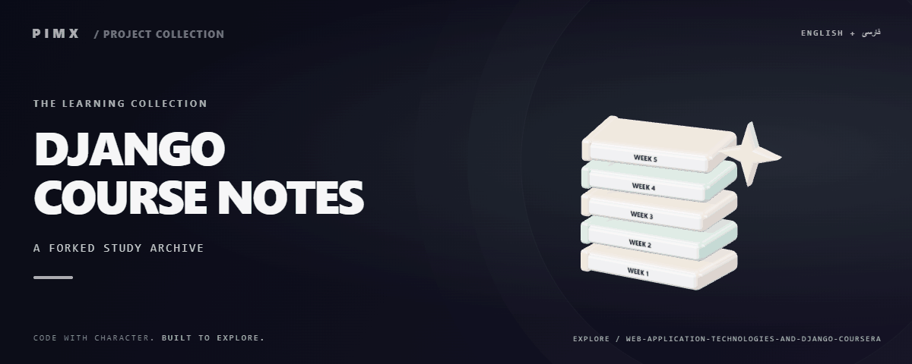

**[English](README.md) · [فارسی](README.fa.md)**

# 📚 DJANGO COURSE NOTES

A forked course-material archive organized by Week 1 through Week 5 for Web Application Technologies and Django.

[GitHub](https://github.com/MOHAMMADREZAABEDINPOOR/Web-Application-Technologies-and-Django-Coursera) · [PIMX / Profile](https://github.com/MOHAMMADREZAABEDINPOOR) · [Static artwork](assets/readme/hero.png)

> This repository is a fork. Source attribution belongs to the upstream authors; the previous README is preserved in docs/UPSTREAM_README.md.

| At a glance | Details |
|:---|:---|
| 📚 Experience | Learning exercise / source archive |
| 🧰 Built with | `Python` |
| 🌐 Documentation | [English](README.md) · [فارسی](README.fa.md) |

[✨ Features](#features) · [🚀 Getting started](#getting-started) · [⚙️ Configuration](#configuration) · [🌍 Deployment](#deployment)

📚 [Original documentation](docs/UPSTREAM_README.md) · [Upstream](https://github.com/MOHAMMADREZAABEDINPOOR)

---

## ✨ Features

| Area | Included capability |
|:---|:---|
| ⚡ Workflow | Week-by-week organization |
| ⚡ Workflow | Course notes/assignment material |
| ⚡ Workflow | Preserved upstream source attribution |

## 🧰 Stack

| Tool | Version / source |
|---|---|
| Python | `standard library / source imports` |

## 🚀 Getting started

Python 3; a desktop/Tk installation for Tkinter or turtle examples. Tkinter is provided by the Python installation, not pip. Legacy dependencies may need a compatible Python version.

This repository is a document archive; no dependency installation is needed to browse it.

## ⚙️ Configuration

No standard environment template is defined. Standalone exercises need no external configuration; inspect any service constants or paths in the source before running.

## 🎯 Usage

Browse the Week directories and the preserved upstream README. This archive has no application entry point or dependency manifest.

## 🗂️ Project structure

| Path | Role |
|---|---|
| [`assets/`](assets/) | Brand/media/README assets |
| [`docs/`](docs/) | Supporting documentation |
| [`Week 1/`](Week%201/) | Exercise content |
| [`Week 2/`](Week%202/) | Exercise content |
| [`Week 3/`](Week%203/) | Exercise content |
| [`Week 4/`](Week%204/) | Exercise content |
| [`Week 5/`](Week%205/) | Exercise content |

## 🧪 Commands and checks

No automated test command is declared in a manifest. Verify behavior through a local example run.

## 🌍 Deployment

This is a local learning exercise, not a public service. Browser exercises can use static hosting.

## 📌 Limitations

Educational materials belong to their respective authors. Treat the repository as a study archive, not a deployed Django application.

## 🛠️ Troubleshooting

- GUI unavailable: use a desktop Python installation with Tk for Tkinter/turtle examples.
- Invalid input: use the numeric/text format expected by the selected script.

## 🤝 Contributing

Create a focused branch, verify the affected behavior and explain the change clearly. Keep private data, build outputs and local databases out of commits.

Supporting guides:

- [docs/UPSTREAM_README.md](docs/UPSTREAM_README.md)

## 📄 License

No repository-level license file is included in this snapshot. Public visibility alone does not grant reuse rights; contact the repository owner for terms.

---

Part of **PIMX** · Documentation in English and Persian.

---

📚 **DJANGO COURSE NOTES** · [English](README.md) · [فارسی](README.fa.md)

